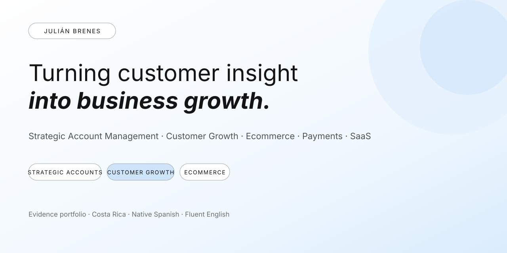
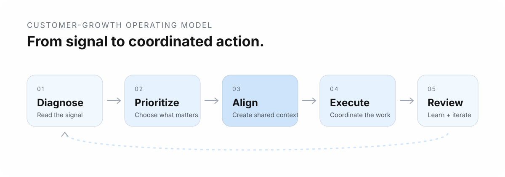

  

# Julián Brenes
### Turning customer insight into business growth.
**Strategic Account Management · Customer Growth · Ecommerce · Payments · SaaS**

I turn customer and business performance data into account priorities, customer conversations, and coordinated action. My experience spans strategic account management at Amazon and AO2, enterprise payments at PayPal, and SaaS sales development at Workday.

**Costa Rica · Native Spanish · Fluent English**  
[LinkedIn](https://www.linkedin.com/in/julian-brenes-rivera/) · [Explore case studies](#selected-case-studies)

## Selected impact

| 300+ | 20 | ~35% | ~25 |
|---:|---:|---:|---:|
| CSMs and account managers adopted a diagnostic tool I built | Amazon US sellers managed | Average YoY GMS growth across that seller portfolio | Large-enterprise merchants managed at PayPal |

Additional portfolio evidence includes approximately **10 Amazon US client accounts** at AO2, with performance approximately **10% above targets**, and seller lifecycle work across **Mexico and Brazil**.

## How I work

My strongest work sits at the intersection of customer context, commercial priorities, and analytical execution.

  

**1. Diagnose** — Use business and customer signals to understand what is happening.  
**2. Prioritize** — Separate the highest-value opportunities and risks from background noise.  
**3. Align** — Turn analysis into clear customer and stakeholder conversations.  
**4. Execute** — Coordinate actions across the account, specialists, and internal partners.  
**5. Review** — Use business reviews, reporting, and experimentation to inform the next decision.

[See the illustrative customer-growth operating model](artifacts/customer-growth-operating-model.md).

## Selected case studies

| Case | What it shows | Evidence |
|---|---|---|
| [Scaling marketplace diagnostics](cases/01-marketplace-diagnostics.md) | Analytical tooling, enablement, cross-functional rollout | Excel/macros framework adopted by 300+ CSMs and account managers |
| [Strategic seller growth](cases/02-strategic-seller-growth.md) | Strategic account ownership and growth planning | 20 US sellers; approximately 35% average YoY GMS growth |
| [Marketplace brand-growth roadmap](cases/03-brand-growth.md) | Brand, content, legal coordination, commercial execution | Broader roadmap associated with approximately 20% annual revenue growth |
| [Ecommerce account strategy](cases/04-ecommerce-accounts.md) | Forecasting, pricing, promotions, inventory, catalog, reporting | Approximately 10 Amazon US accounts; portfolio approximately 10% above targets |
| [Enterprise merchant relationships](cases/05-enterprise-payments.md) | Enterprise account planning, payments adoption, business reviews | Approximately 25 large-enterprise merchants across retail, ecommerce, and travel |
| [Seller onboarding and lifecycle](cases/06-seller-lifecycle.md) | Segmentation, experimentation, SQL/Redshift, lifecycle thinking | Mexico and Brazil seller onboarding programs |

## Illustrative working artifacts

These are **original portfolio reconstructions using generic or synthetic examples**. They are not employer-owned templates, internal screenshots, customer records, or source data.

- [Marketplace diagnostic framework](artifacts/marketplace-diagnostic-framework.md) — a simplified example of how traffic and conversion signals can be turned into account questions and priorities.
- [Strategic account review template](artifacts/strategic-account-review-template.md) — a generic structure for translating account performance into a customer-facing business review.
- [Customer-growth operating model](artifacts/customer-growth-operating-model.md) — the operating loop connecting analysis, prioritization, stakeholder alignment, execution, and review.

## Capability map

**Strategic account management**  
Account planning, business reviews, stakeholder coordination, growth opportunities, customer communication.

**Customer growth / customer success**  
Customer insight, enablement, adoption-focused conversations, cross-functional advocacy, lifecycle thinking.

**Ecommerce**  
Traffic and conversion analysis, catalog, pricing, promotions, inventory, Account Health, forecasting, commercial reporting.

**Payments**  
Enterprise merchant relationships, payment adoption, commercial initiatives, KPI reviews.

**Analytical execution**  
Excel/macros, Salesforce, Tableau, SQL/Redshift experience, experimentation, and business recommendations.

## Career context

My Amazon experience includes Customer Success, Strategic Account Management, Senior Strategic Account Management, Brand Registry, and Email Product Management for LATAM. At AO2, I managed Amazon US accounts and coordinated with PPC specialists. At PayPal, I worked as a Large Enterprise Account Executive in Mexico.

I currently work as a Senior Sales Development Representative at Workday, focused on inbound discovery, qualification, and coordination with account executives.

## Evidence and confidentiality

This portfolio is designed as a public evidence layer for my professional experience.

- Figures are approximate where explicitly indicated.
- Portfolio and program outcomes reflect broader business performance and team contributions; they are not claims of isolated causal impact.
- Employer-owned code, source datasets, internal presentations, confidential thresholds, customer records, and credentials are not published.
- Illustrative artifacts are reconstructions created for this portfolio and use generic or synthetic examples.

For a conversation about strategic accounts, customer growth, ecommerce, payments, or SaaS, [connect with me on LinkedIn](https://www.linkedin.com/in/julian-brenes-rivera/).
