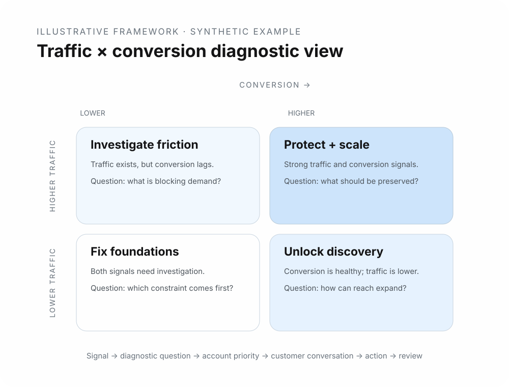

# Illustrative marketplace diagnostic framework
**Portfolio artifact · Synthetic example · Not an employer-owned tool**

[← Back to portfolio](../README.md) · [Related case study](../cases/01-marketplace-diagnostics.md)

## Purpose

This artifact illustrates the type of analytical thinking behind a four-quadrant traffic/conversion framework. It is a **simplified reconstruction created for this portfolio**.

It does not reproduce Amazon thresholds, source code, customer data, internal documentation, or the original Excel/macros implementation.

## Diagnostic view

  

A simple way to structure marketplace performance is to ask two separate questions:

1. **Are customers reaching the offer?** — represented here by traffic.
2. **Are those visits turning into purchases?** — represented here by conversion.

|  | Lower conversion | Higher conversion |
|---|---|---|
| **Higher traffic** | Investigate why existing demand is not converting | Understand what is working and where further scale may be possible |
| **Lower traffic** | Diagnose foundational issues before assuming a traffic-only problem | Investigate discoverability and acquisition while protecting conversion quality |

The labels are intentionally generic. In a real account review, the next question depends on the business context.

## Synthetic example

| Account | Traffic index | Conversion index | Diagnostic question |
|---|---:|---:|---|
| A | 82 | 78 | What is driving strong performance, and what should be protected or scaled? |
| B | 76 | 31 | What is creating friction after customers reach the offer? |
| C | 29 | 72 | Is discoverability limiting an otherwise effective offer? |
| D | 33 | 35 | Which fundamentals should be investigated before selecting a growth lever? |

*Indexes above are fabricated solely to demonstrate the framework.*

## From metric to account conversation

A useful framework should not end with a quadrant. It should help move through a decision sequence:

**Signal → diagnostic question → account priority → customer conversation → action → review**

Examples of follow-up areas can include catalog quality, pricing, promotions, inventory, content, or other marketplace factors depending on the account.

## Why this artifact is in the portfolio

The original professional contribution was not simply “building an Excel file.” The transferable capability was creating structure around a recurring analytical task and making that structure usable by other customer-facing professionals.

The supported historical outcome is adoption by **300+ CSMs and account managers**. No revenue or conversion impact is attributed to the original tool.
